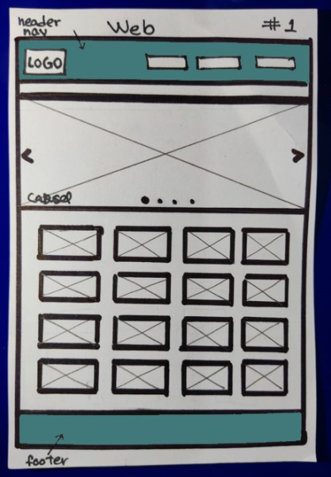
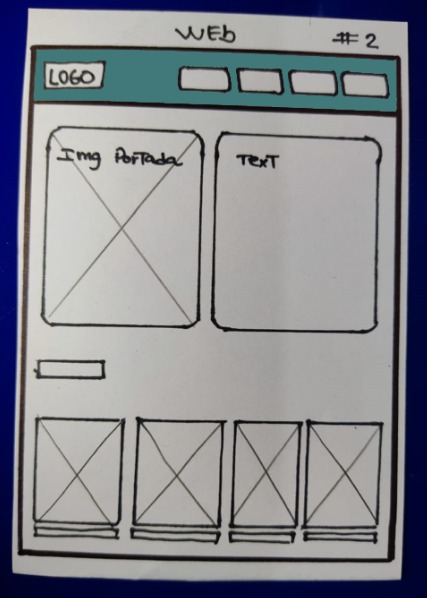
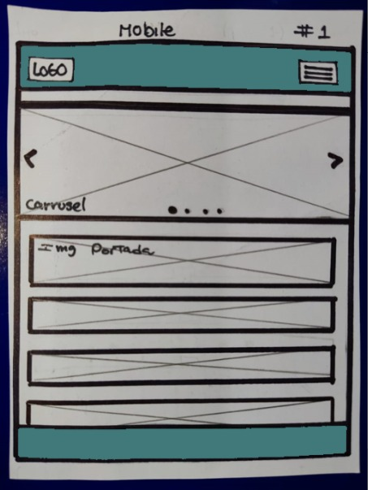
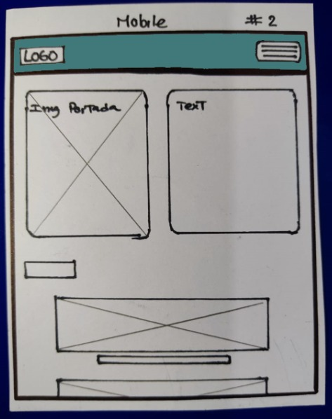
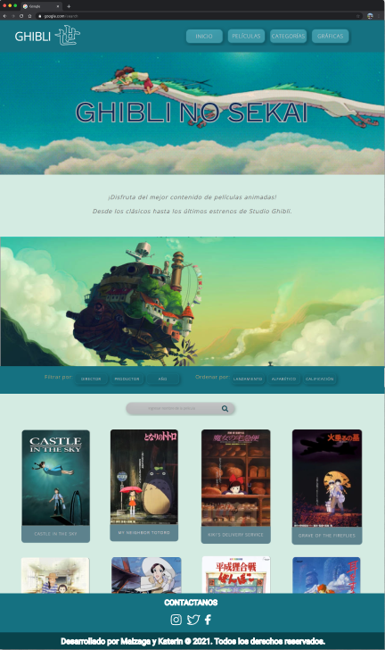

# GHIBLI NO SEKAI

## Descripción

Ghibli no Sekai es una platafoma que le permite a los usuarios acceder a información general y detallada de una gran cantidad de películas producidas por Studio Ghibli.

## Studios Ghibli

El Studio Ghibli (スタジオジブリ Sutajio Jiburi?) es un estudio de animación japonés, con sede en Tokio. Fundada en 1985 por Isao Takahata y Hayao Miyazaki, y a hasta la fecha, han realizado más de 20 películas. Tienen el respeto tanto del público japonés como el internacional, donde tanto la crítica como el sector de la animación le presenta muchos respetos.

##  Definición del Producto 

##  Resumen del proyecto

El proceso de desarrollo de la interfaz Ghibli no Sekai tomo 4 semanas aproximadamente.Tomando en cuenta la planificación prototipado y cóodificación del makup en html y css, funcionalidades de js y pruebas.En todo el proceso se realizaron pruebas de usabilidad para corregir y hacer mejoras de las funcionalidades y estilos.

## Diseño de la Interfaz de Usuario

- **Prototipo - Baja fidelidad**

  
Sketch:

  

Prototipo web (vista 1)

    
  

  

Prototipo web (vista 2)

    
  

  

Prototipo mobile (vista 1)

     
  

  

Prototipo mobile (vista 2)

    
  

- **Prototipo - Alta fidelidad**
  
Figma:

  

Link del portafolio de Figma 

    * [Portafolio con los prototipos por cada Sprint](https://www.figma.com/file/Jrh6cG8fDrsgbElrL30FNu/Data-lovers---Team-K%26M?node-id=0%3A1)  
  

   

## Historias de Usuario
  

Link de las historias

   * [Historias de Usuario](https://docs.google.com/document/d/16qly3qnbOpn1K6DCBMk4-HYfJXRKFt7pBAau-bxgvAg/edit)  
  

## Problemas detectados a través de tests de usabilidad
1. Las imagenes pueden ser muy grandes.
2. Letras un poco pequeñas.
3. Los dropdonws estan largos.
4. Al seleccionar película la siguiente vista debe visualizarse siempre desde la parte superior.

Link del formulario usado para el test

  * [formulario](https://docs.google.com/forms/d/1CJleVUI6vlU0zUtJsPCDKG6XVD9zySLm_U_sG91EO1Y/viewform?edit_requested=true&fbzx=-1130660339603111466)  

## Link de GitHub Pages 
[Ghibli no Sekai](https://pandartist93.github.io/LIM016-data-lovers/)

## CONDICIONES DEL PROYECTO 

A continuación encontrarás el link [README.md](https://github.com/Laboratoria/LIM016-data-lovers) que contiene las especificaciones bajo las cuales se realizo el proyecto. 

